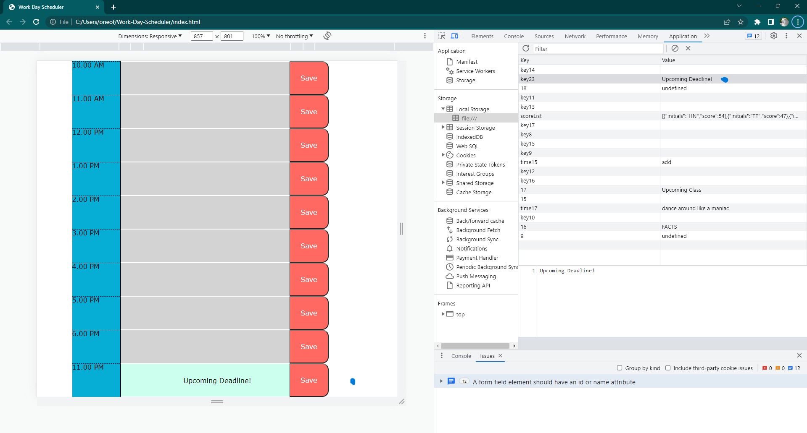
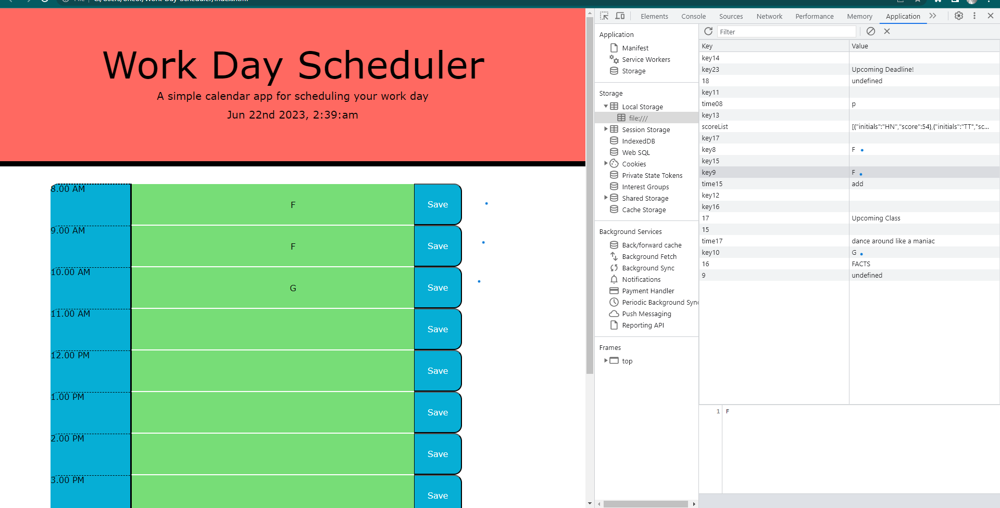

# Work Day Scheduler

## Description

This is a small functioning work day scheduling application. The project itself is useful for everyone, it can be used to schedule your work day events.The main purpose of this application is to help users remember their day to day work day activities. The application is made using third party web API's. It has significantly improved my skills as I continue to learn new ones.

## Table of Contents

- [Installation](#installation)

- [Usage](#usage)

- [Credits](#credits)

- [License](#license)

- [Tests](#tests)

## Installation

The URL will mostly work in all the browsers. Preferred Browser is Google Chrome and the extension Chrome DevTools Extension to view the source code and local storage. GitHub is the cloud service for projects/repositories. You can simply visit the URL to view the repository in your browser:

[Work-Day-Scheduler](https://github.com/hafsah1976/Work-Day-Scheduler)

## Usage

Users can schedule by clicking on input placeholder and then clicking the Save button.

## Credits

[Third Party API's](https://getbootstrap.com/docs/4.5/getting-started/download/)

[DayJs](https://day.js.org/docs/en/durations/locale)

[MomentJS](https://momentjs.com/guides/)

[BootstrapCSS](https://getbootstrap.com/docs/4.0/components/jumbotron/)

## License

Copyright (c) 2023 hafsah1976

Permission is hereby granted, free of charge, to any person obtaining a copy
of this software and associated documentation files (the "Software"), to deal
in the Software without restriction, including without limitation the rights
to use, copy, modify, merge, publish, distribute, sublicense, and/or sell
copies of the Software, and to permit persons to whom the Software is
furnished to do so, subject to the following conditions:

The above copyright notice and this permission notice shall be included in all
copies or substantial portions of the Software.

THE SOFTWARE IS PROVIDED "AS IS", WITHOUT WARRANTY OF ANY KIND, EXPRESS OR
IMPLIED, INCLUDING BUT NOT LIMITED TO THE WARRANTIES OF MERCHANTABILITY,
FITNESS FOR A PARTICULAR PURPOSE AND NONINFRINGEMENT. IN NO EVENT SHALL THE
AUTHORS OR COPYRIGHT HOLDERS BE LIABLE FOR ANY CLAIM, DAMAGES OR OTHER
LIABILITY, WHETHER IN AN ACTION OF CONTRACT, TORT OR OTHERWISE, ARISING FROM,
OUT OF OR IN CONNECTION WITH THE SOFTWARE OR THE USE OR OTHER DEALINGS IN THE
SOFTWARE.

## Tests

1; Testing Input

A second example:- Blue dots indicate the text added is saved in the local storage.

2; Viewing Value Stored in Local Storage - the blue circles indicate the value that was entered got stored.

3; Checking Interactive Save Button

4; Check Deployment

